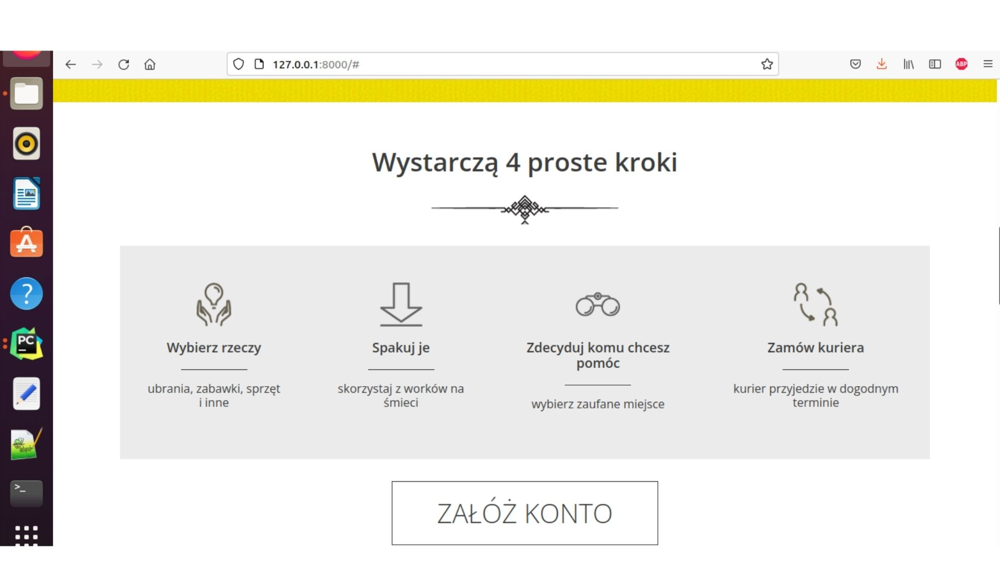

# Project_clothes - portfolio
##Project name
The aim of the project is to create a place where everyone can donate unnecessary things to trusted institutions. 

##Table of contents
* [General info](#general-info)
* [Technologies](#technologies)
* [Screenshots](#screenshots)
* [Setup](#setup)
* [Project Status](#project-status)
* [Room for Improvement](#room-for-improvement)
* [Contact](#contact)

##General Information
The user has things at home that he wants to giveaway of, but does not know how.
There are many solutions available, but many of them require additional effort or are mistrusted. You have to go to the verified places, and there is no time / there is no way to go there, and the containers at home or local collections are unverified and it is not known whether these things will actually go to those in need. 

##Technologies
* [Python](#python)
* [Django](#django)
* [Javascript](#javascript)
* [CSS](#css)
* [PostgreSQL](#postgresql)

##Screenshots
 

##Setup
The first thing to do is to clone the repository:

$ git clone https://github.com/igorrrekd/Project_clothes.git

$ cd Project_clothes

Create a virtual environment to install dependencies in and activate it:

$ virtualenv2 --no-site-packages env

$ source env/bin/activate

Note the (env) in front of the prompt. This indicates that this terminal session operates in a virtual environment set up by virtualenv2.

Once pip has finished downloading the dependencies:

$ cd clothes
$ python manage.py runserver

And navigate to http://127.0.0.1:8000//donate/.

##Project status
Project is still being developed.

##Room of improvement
I am happy to receive bug reports, fixes, documentation enhancements, and other improvements.
Please report bugs via the github issue tracker.
Master git repository:
* git clone git://github.com/igorrrekd/Project_clothes.git

##Contact

Linkeind: https://linkedin.com/in/igor-daniłowicz

Project Link: https://github.com/igorrrekd/Project_clothes.git
